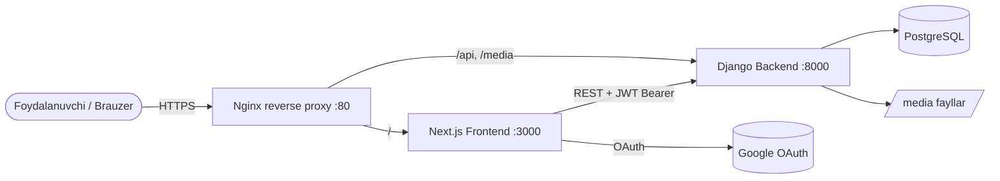

# Architecture Overview

Platforma to'rt xizmatdan iborat (Docker Compose orqali orkestratsiya qilinadi). Batafsil: [[Tech Stack]], [[Deployment]].

## Komponentlar diagrammasi



## Ma'lumot oqimi (yuqori daraja)

1. Foydalanuvchi **Google** orqali kiradi → NextAuth Google access tokenni Django'ning JWT tokeniga almashtiradi. Batafsil: [[Auth and Session]].
2. Foydalanuvchi **[[Onboarding Form|7 bosqichli so'rovnoma]]**ni to'ldiradi.
3. So'rovnoma `POST /api/patients/` orqali saqlanadi va shu zahoti **[[Diagnosis Service|tashxis hisoboti]]** atomik tarzda yaratiladi.
4. Foydalanuvchi **[[Diagnosis Result Page|natija sahifasi]]**ga yo'naltiriladi, u saqlangan hisobotni o'qiydi.

Asosiy uchidan-uchiga ssenariy: [[Assessment Save Flow]].

## Kataloglar tuzilmasi

```
Dementia/
├── backend/            # Django + DRF (qarang: [[Backend Overview]])
│   ├── core/           # settings, urls, wsgi
│   └── patients/       # asosiy ilova: models, services, views, tests
├── frontend/           # Next.js App Router (qarang: [[Frontend Overview]])
│   └── src/
│       ├── app/        # sahifalar (locale bo'yicha)
│       ├── components/ # OnboardingForm, Providers, ...
│       └── lib/        # api klient, session-refresh
├── nginx/              # reverse proxy config
├── docs/               # ⬅️ shu Obsidian vault
└── docker-compose.yml
```

## Dizayn tamoyillari

> [!tip] Pro prinsiplar
> - **Atomiklik**: so'rovnoma va uning tashxisi bitta tranzaksiyada saqlanadi.
> - **Idempotentlik**: tashxisni qayta so'rash dublikat yaratmaydi.
> - **Determinizm**: bir xil kirish ma'lumotlari har doim bir xil natija beradi.
> - **Xavfsizlik**: har bir foydalanuvchi faqat o'z ma'lumotlarini ko'radi (user-scoped queryset).

Bog'liq: [[Diagnosis Save Fix]].
