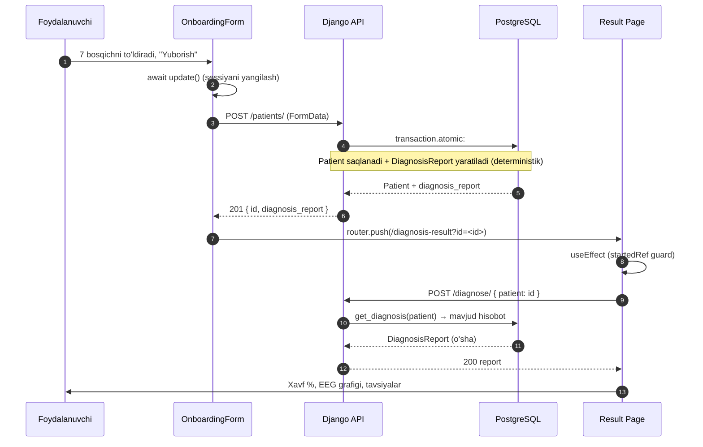

# Assessment Save Flow

Bu — tizimning **yuragi**: so'rovnomani topshirishdan tashxisni ko'rsatishgacha bo'lgan uchidan-uchiga oqim ("tashxis topshirish").

## Ketma-ketlik diagrammasi

## Kalit nuqtalar

> [!important] Bitta haqiqat manbai
> Tashxis hisoboti so'rovnoma **saqlanganda** (3-qadam) yaratiladi, natija sahifasida emas. Natija sahifasi faqat **o'qiydi**. Shu sabab:
> - Refresh natijani o'zgartirmaydi (deterministik).
> - StrictMode/refresh/retry dublikat yaratmaydi (idempotent + UNIQUE).
> - Saqlangan baholash har doim aniq bitta hisobotga ega (atomik).

## Buzilish nuqtalari va himoyalar
| Xavf | Himoya |
|---|---|
| Ikki marta POST (StrictMode) | `startedRef` guard + backend idempotent |
| Poygada ikki insert | OneToOne UNIQUE + `get_or_create` + `IntegrityError` ushlash |
| Noto'g'ri baholash ochilishi | `?id=` aniq uzatiladi |
| Yarim saqlash (patient bor, report yo'q) | `transaction.atomic` rollback |
| Tushunarsiz xato ekrani | `formatApiError` + `errorMsg` ko'rsatish |
| Server xatosi ko'rinmasligi | `LOGGING` + `logger.exception` |

Sabab-tahlil: [[Diagnosis Save Fix]]. Modellar: [[Data Models]]. Servis: [[Diagnosis Service]].
