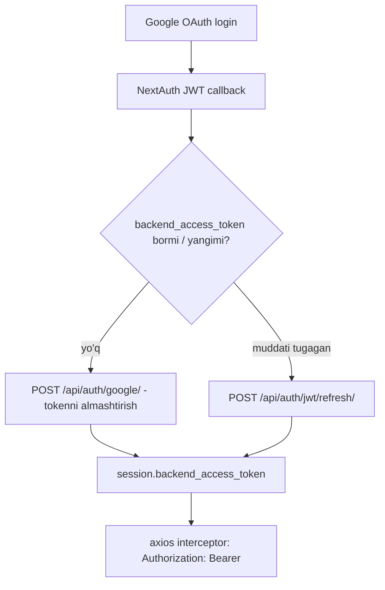

# Auth and Session

Google OAuth (NextAuth) → Django JWT almashuvi. Manbalar: `app/api/auth/[...nextauth]/route.ts`, `lib/api.ts`, `lib/session-refresh.ts`, `components/SessionRefresher.tsx`.

## Token oqimi

- **JWT callback** (`route.ts`) Google access/refresh tokenlarini boshqaradi va Django backend tokenini oladi/yangilaydi.
- **`lib/api.ts`** request interceptor har so'rovga `Authorization: Bearer <backend_access_token>` qo'shadi; FormData uchun `Content-Type`ni o'chiradi (runtime boundary qo'yadi).
- **401 retry:** response interceptor 401 da bir marta `refreshAuthSession()` qiladi va so'rovni qayta yuboradi; baribir token yo'q bo'lsa `BackendAuthError` qaytaradi.
- **Fail-fast (muhim):** sessiya bor-u backend token yo'q bo'lsa, request interceptor so'rovni **umuman yubormaydi** — darhol `BackendAuthError` tashlaydi. Bu profil sahifasidagi cheksiz 401 siklini bartaraf etadi. Batafsil: [[Session 401 Loop Fix]].

## `formatApiError` (markazlashtirilgan)
`lib/api.ts`'da. Har qanday xatoni o'zbekcha xabarga aylantiradi:
- DRF maydon-xatolari `{age: ["..."]}` → `"Yosh: ..."` (`FIELD_LABELS` xaritasi)
- `detail`, `error`, `non_field_errors`
- 401 → qayta kirish; 404 → topilmadi; 5xx → server xatosi; `Network Error`

[[Onboarding Form]] va [[Diagnosis Result Page]] ikkalasi ham shundan foydalanadi.

## Qo'llangan qattiqlashtirishlar (auth)
> [!success] Bajarildi
> - **Fail-fast:** token yo'q bo'lsa so'rov yuborilmaydi (cheksiz 401 sikli tuzatildi). [[Session 401 Loop Fix]].
> - **Interceptor qoplamasligi:** aniq o'rnatilgan `Authorization` sarlavhasi (retry yo'li) qoplanmaydi.
> - **`refreshAuthSession` sessiyani qaytaradi** — "no-op" yangilanish aniqlanadi, eskirgan token bilan retry-storm bo'lmaydi.
> - **Multipart oldidan rad etish:** [[Onboarding Form|so'rovnoma saqlash]] tokensiz bo'lsa, katta yuklamadan oldin to'xtaydi.
