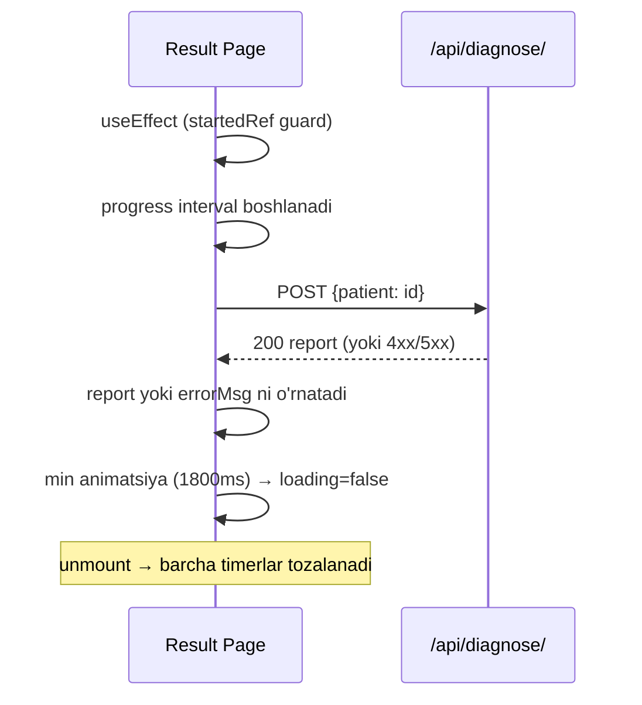

# Diagnosis Result Page

Manba: `frontend/src/app/[locale]/diagnosis-result/page.tsx`. Tashxis hisobotini ko'rsatadi: xavf doirasi, EEG to'lqin grafigi (recharts), tavsiyalar.

## Hayotiy sikl (lifecycle)

## Saqlash bilan bog'liq tuzatishlar

> [!important] StrictMode guard
> `const startedRef = useRef(false)` — React 18 StrictMode `useEffect`ni **ikki marta** chaqiradi. Guard'siz `/diagnose/` ikki marta POST qilinardi. Backend baribir idempotent, lekin guard ortiqcha so'rovni butunlay oldini oladi.

> [!important] Timer cleanup
> `progressTimer` (interval) va `revealTimer` (timeout) `return () => {...}` cleanup'da tozalanadi; `cancelled` bayrog'i unmount'dan keyin `setState` chaqirilishini to'sadi. (Eski kodda interval xato holatida tozalanmasdan qolardi.)

> [!important] To'g'ri baholashni o'qish
> `id` query paramdan o'qiladi (`URLSearchParams`) va `POST /diagnose/ {patient: id}` yuboriladi → aynan saqlangan hisobot. [[Onboarding Form]] uni uzatadi.

## Xatolarni boshqarish
- `errorMsg` — `formatApiError(error)` natijasi; `!report` ekranida ko'rsatiladi (umumiy "Xatolik" emas).
- **Qayta urinish** tugmasi — `window.location.reload()` (backend idempotent, xavfsiz).
- **Yangi so'rovnoma** — `/onboarding`.
- Backend auth xatosi → 1.2s dan keyin login sahifasiga (`router.replace`).

Bog'liq: [[Assessment Save Flow]], [[Diagnosis Save Fix]].
