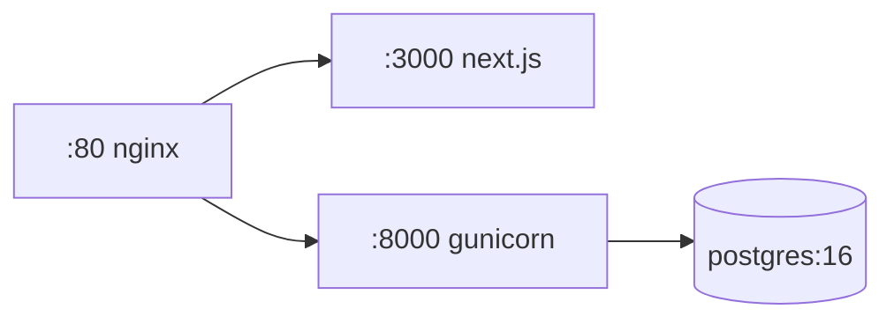

# Deployment (Docker)

Manba: `docker-compose.yml`, `backend/Dockerfile`, `backend/entrypoint.sh`, `nginx/`.

## Xizmatlar


| Xizmat | Image / Build | Izoh |
|---|---|---|
| `db` | `postgres:16-alpine` | `healthcheck` bilan |
| `backend` | `./backend` | Gunicorn (3 worker), `entrypoint.sh` |
| `frontend` | `./frontend` | Next.js, build-time env args |
| `nginx` | `nginx:1.27-alpine` | reverse proxy `:80` |

## Ishga tushirish
```bash
# repo ildizida .env to'ldirilgan bo'lsin (qarang: Environment Variables)
docker compose up --build -d
docker compose logs -f backend
```

## `entrypoint.sh` ketma-ketligi
1. PostgreSQL tayyor bo'lishini kutadi.
2. Media kataloglarni yaratadi.
3. `migrate --noinput` ← ⚠️ **migration 0005 shu yerda qo'llanadi**.
4. `collectstatic --noinput`.
5. Gunicorn ishga tushadi.

> [!danger] Migration 0005
> Idempotentlik DB UNIQUE chekloviga bog'liq. Deploy'dan keyin tasdiqlang:
> ```bash
> docker compose exec backend python manage.py showmigrations patients
> ```
> Batafsil: [[Diagnosis Save Fix]].

Bog'liq: [[Environment Variables]], [[Local Development]].
